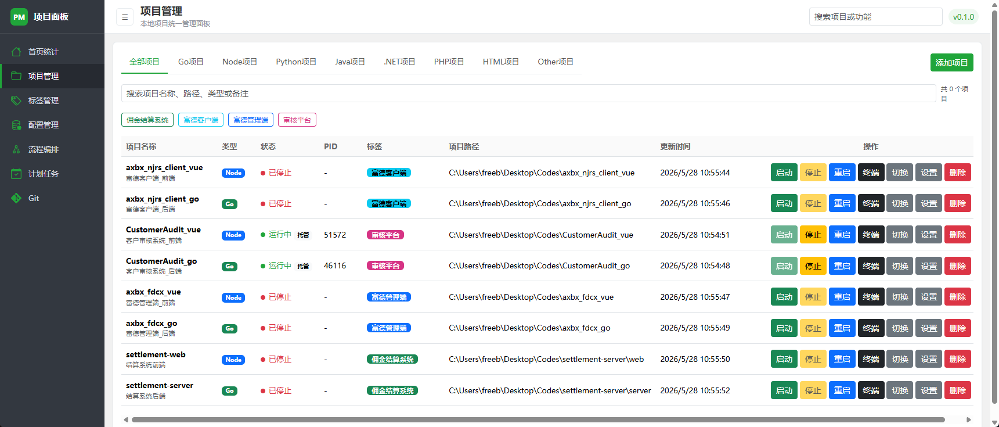
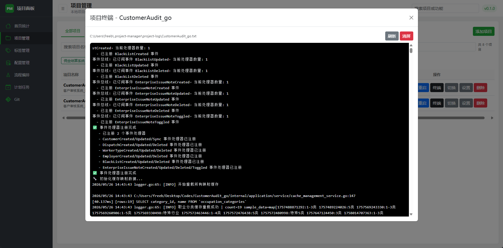
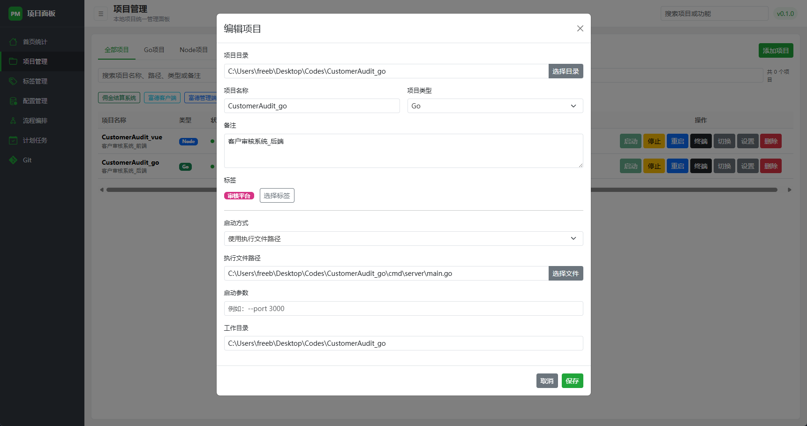
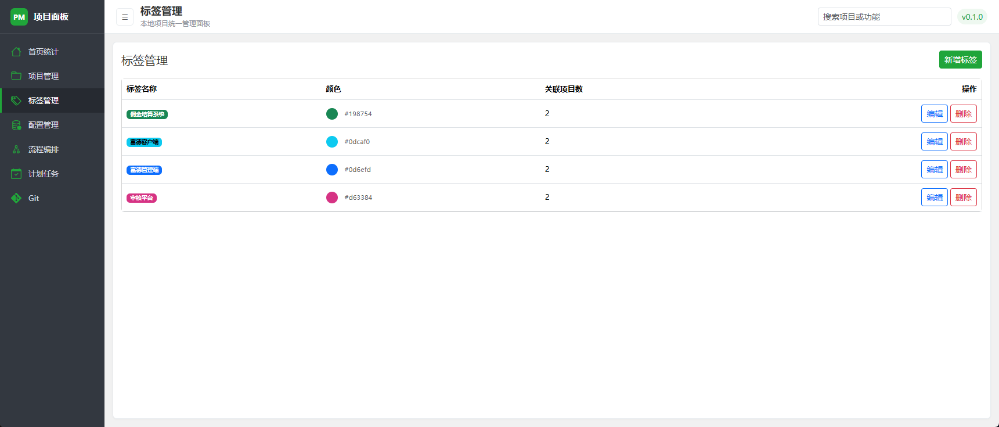
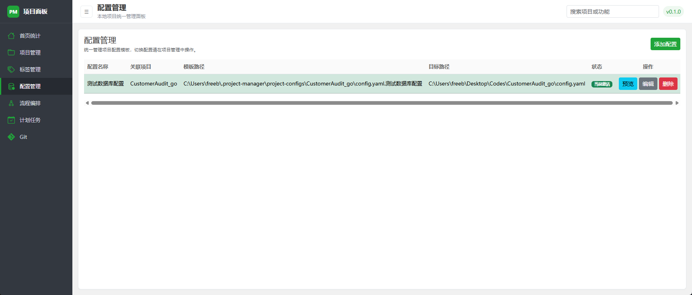
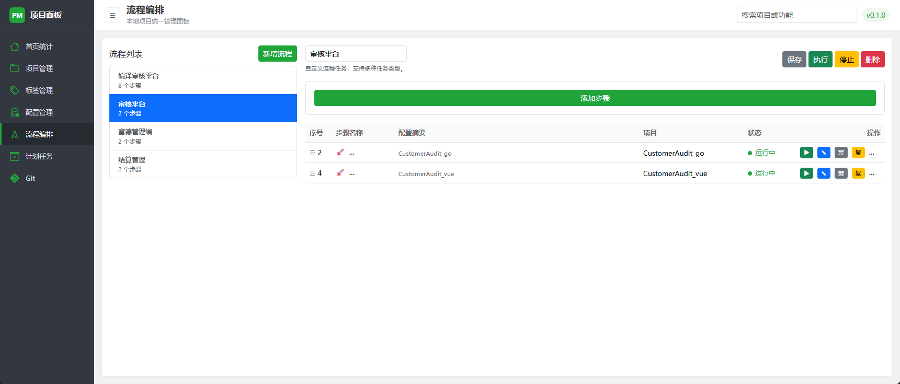
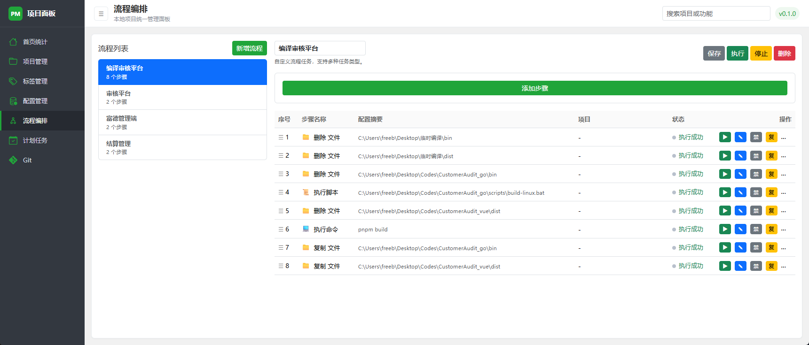

# 本地项目管理系统 (Project Manager)

> 一站式本地开发项目管理工具，告别多项目启动的繁琐，让日常开发工作流自动化。

## 痛点与背景

作为开发者，日常工作中经常面对以下困境：

- **多项目启动繁琐** — 一个业务往往由前端 + 后端 + 多个微服务组成，每次开发前需要逐个打开终端、切换目录、输入启动命令，耗时且容易遗漏。
- **项目状态不可见** — 不清楚哪些项目正在运行、哪些已经停止，需要手动检查进程或翻找终端窗口。
- **配置切换麻烦** — 开发/测试/生产环境的配置文件不同，手动复制粘贴容易出错，切换环境靠记忆力。
- **重复性操作多** — 构建前清理旧产物、编译、复制文件等步骤重复且机械，纯靠手动执行效率低下。
- **项目信息分散** — 项目路径、技术栈、关联关系等信息散落在各处，没有统一的管理视图。

## 解决方案

**本地项目管理系统**是一款基于 Electron 的桌面应用，围绕本地开发项目提供统一的管理、启停、监控和自动化能力：

- **一键启停** — 注册项目后，点击按钮即可启动/停止，无需记忆命令和路径。
- **状态总览** — 首页仪表盘实时展示所有项目的运行状态、数量统计，一目了然。
- **流程编排** — 将多步操作编排为自动化流程（启动项目、执行命令、文件操作、HTTP 请求等），一键执行完整工作流。
- **配置管理** — 统一管理项目配置文件，支持一键切换不同环境配置。
- **标签分类** — 为项目打标签，按技术栈、业务线等维度分组管理。
- **终端集成** — 内置终端查看项目实时输出日志，无需切换窗口。

## 功能截图

### 项目管理

支持多种项目类型（Node、Go、Python、Java 等），提供启动、停止、重启、终端查看、配置切换等操作。按类型分类筛选，支持搜索和批量操作。



### 项目终端

内置终端实时展示项目运行日志，支持 ANSI 彩色输出。



### 项目设置

为每个项目配置启动方式、执行文件路径、启动参数、工作目录、标签等信息。



### 标签管理

自定义标签对项目进行分组和分类，快速筛选同类项目。



### 配置管理

统一管理项目配置文件模板，支持一键切换环境配置（开发/测试/生产），避免手动复制出错。



### 流程编排

将多步操作组合为自动化流程，支持以下步骤类型：

- **启动/停止项目** — 自动启停指定项目
- **执行命令** — 运行 shell 命令
- **执行脚本** — 运行脚本文件
- **文件操作** — 复制、移动、删除文件或目录
- **HTTP 请求** — 发送 HTTP 接口调用
- **延时等待** — 步骤间添加延时
- **通知** — 发送执行结果通知

支持拖拽排序、单步执行、启用/禁用步骤、执行日志查看。





## 技术栈

| 层级 | 技术 |
|------|------|
| 框架 | Electron |
| 前端 | 原生 JS + Bootstrap 5 + Bootstrap Icons |
| 终端 | xterm.js |
| 数据库 | better-sqlite3 |
| 进程管理 | Node.js child_process |
| 构建打包 | electron-builder |

## 快速开始

### 环境要求

- Node.js >= 18
- Windows 操作系统（当前版本）

### 安装依赖

```bash
npm install
```

### 开发运行

```bash
npm start
```

### 打包构建

```bash
npm run build
```

构建产物输出到 `dist/` 目录。

## 项目结构

```
project-manager/
├── main/                    # 主进程
│   ├── index.js             # 应用入口
│   ├── preload.js           # 预加载脚本（IPC 桥接）
│   ├── database/            # SQLite 数据库层
│   ├── process-manager/     # 进程管理（启停项目）
│   ├── project-manager/     # 项目 CRUD
│   ├── workflow-manager/    # 流程编排引擎
│   ├── config-manager/      # 配置管理
│   ├── tag-manager/         # 标签管理
│   └── settings-manager/    # 系统设置
├── renderer/                # 渲染进程
│   ├── index.html           # 主页面
│   ├── css/                 # 样式
│   ├── js/                  # 通用脚本
│   └── pages/               # 各功能页面模块
├── images/                  # 截图资源
├── package.json
└── electron-builder.yml     # 打包配置
```

## 开发状态

> ⚠️ 本项目目前处于**活跃开发中**，功能持续迭代。

- 当前仅支持 **Windows** 系统
- 未来计划支持 **Linux** 平台
- 欢迎提交功能 PR 和 Issue，共同完善本项目

## License

MIT
